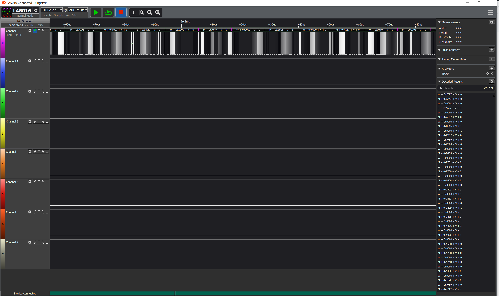

SPDIF Logic Analyzer
====================

This plugin is for use in the [Kingst VIS](http://www.qdkingst.com/en/download) program to decode captured data from any SPDIF Interface.

It's a modified version of [https://github.com/pfrench42/saleae_spdif]

- Support 16 / 24 Bit format
- Auto-clocking, will track changes in clock speed.
- Display Valid & Channel status bit
- Marks "B" frame boundaries with a green dot
- Marks out-of-sequence "B" frames & first frame with a red dot 
- Marks non-decodable gaps in SPDIF interface with red X
- WAV Output, save the capture to a wave file (48.0 kHz only)
- RAW Output, save all 32-bit words from the interface
- Errors show in data table

So far I've built/run it on 64 bit windows.
